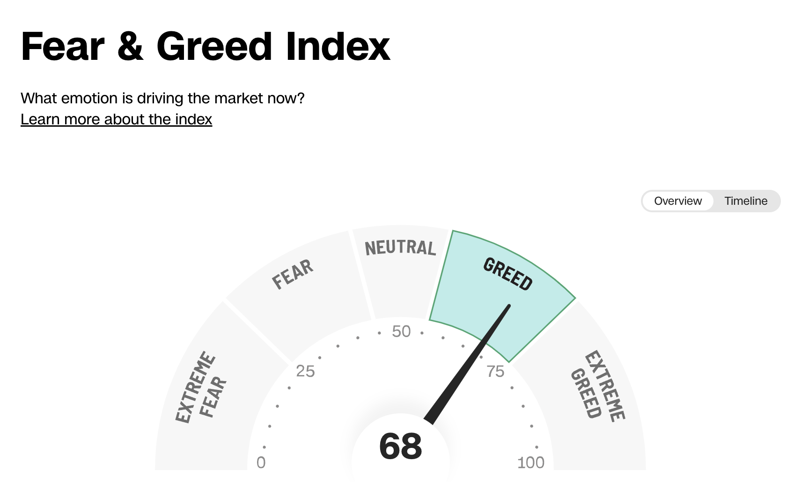
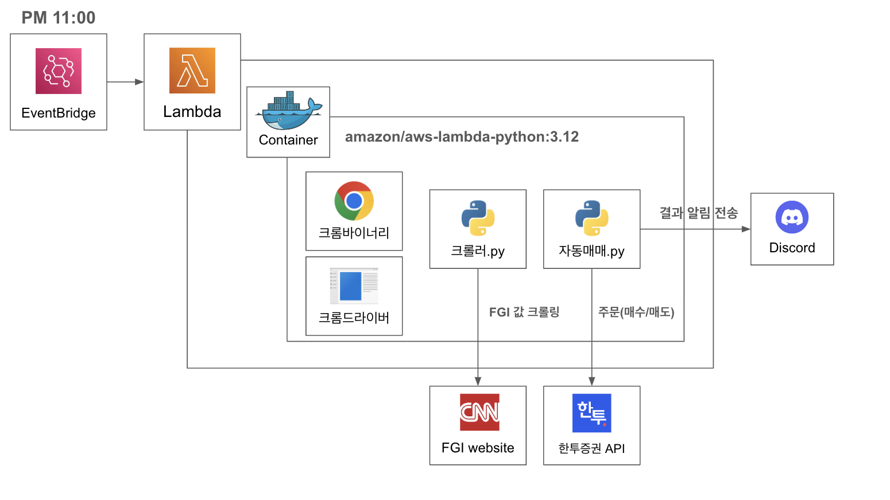
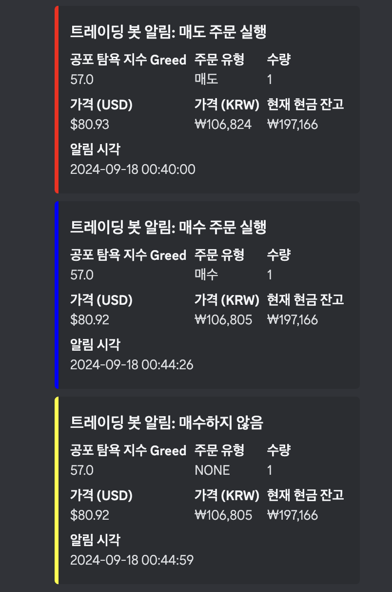

# FGI 지수를 기반으로한 미국 ETF 자동매매 프로젝트

| 항목 | 링크 |
|------|------|
| 자동매매 | [누구나 쉽게 주식 투자 자동화 - 배경지식 없이 20분만에 똑똑한 국내, 해외 자동매매 시스템 완성](https://www.youtube.com/watch?v=2Hxfb5HT4kE&t=108s) |
| AWS | [AWS Lambda에서 크롬 셀레니움 사용하기](https://youtu.be/8XBkm9DD6Ic?si=A2MK2qkXNyTr70i8) |
| KIS API | [한국투자증권 API 문서](https://apiportal.koreainvestment.com/apiservice) |

# Fear And Greed Index(공포 탐욕지수)란?
[CNN Fear & Greed Index](https://edition.cnn.com/markets/fear-and-greed)
CNN에서 제공하는 주식 시장의 전반적인 심리 상태를 나타내는 지표입니다.  
이 지수는 투자자들의 감정이 시장에 미치는 영향을 측정하려는 목적으로 만들어졌습니다.  

지수는 아래 7가지 요소를 고려하여 계산됩니다
  - 주가 모멘텀
  - 주가 강도
  - 주가 폭
  - 풋/콜 옵션 비율
  - 채권 수익률
  - 시장 변동성
  - 안전자산 수요

# 매매전략(대중의 심리에 반대로 투자하라)
### Be fearful when others are greedy, and greedy when others are fearful

워렌 버핏의 유명한 격언을 현실화한 전략 

미국장이 열리는 모든 날
| 지수 상태 | 행동 |
|-----------|------|
| EXTREME FEAR | 2주 매수 |
| FEAR | 1주 매수 |
| NEUTRAL | 행동 없음 |
| GREED | 1주 매도 |
| EXTREME GREED | 2주 매도 |

[장점]
1. 극단적인 감정에 휩쓸리지 않고 냉정하게 매매
2. 공포 시기에 저평가된 주식 매수
3. 시장이 과열됐을 때 적절히 이익을 실현

[단점]
- 회사의 잠재력이나 가능성을 보지않고 투자자들의 심리만 보는 투자전략임

## 사전 준비
- 한국투자증권 비대면 계좌계설
- 한국투자증권 API 키 발급
- 디스코드(Discord) 가입

# 개발

## 구현 아키텍쳐

### 개발하면서 느낀 점(삽질 포인트)
1. bs4를 사용하지않고 Selenium을 사용 (CNN 웹페이지의 FGI 값이 동적으로 된 값이기 때문임)
2. Lambda를 도커 컨테이너로 구현 (크롬을 사용하려면 여러 의존성 패키지를 설치해야하는데 Lambda에서 제공하는 레이어 용량을 제한을 넘음)
3. 크롬 바이너리는 반드시 headless를 사용해야한다.(로컬에서 정상 작동되는데 Lambda에서 에러나서 살펴보았더니, lambda는 GUI 환경이 아니기때문에 headless 버전으로 다운 받아야함)
4. 크롬 옵션을 추가(옵션을 추가하지않을 경우 웹사이트에서 봇으로 간주하여 접속을 거부할 수 있음)

### 테스트 결과

